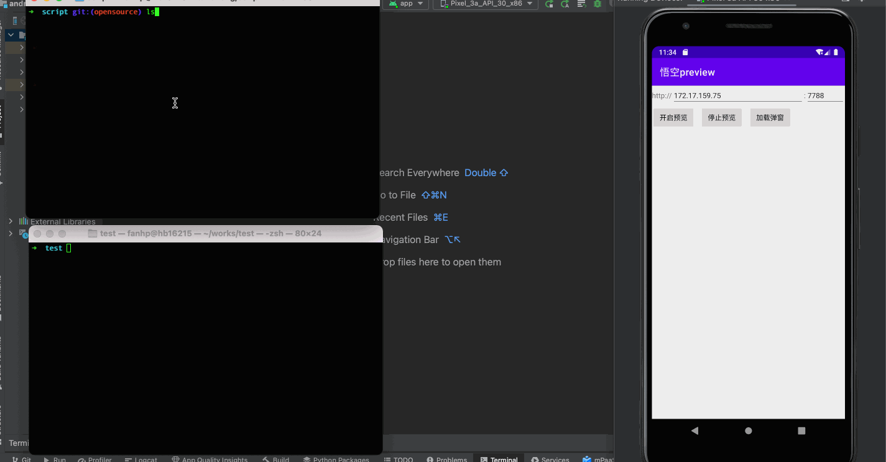

 

    <h1 align="center">Wukong</h1>

  
  
  

 
 

## 简介
悟空动态卡片 (Wukong) 最初是为哈啰出行投放系统定制的 Native 高性能渲染引擎，是一套完整的跨端原生局部卡片动态展示的技术解决方案，以业务赋能为中心，致力于解决UI定制化、逻辑动态化、缩短试错周期、提升人效以及减少包体积等相关问题，使得业务可以基于 Wukong 做到一次开发，随时上线，多端复用的效果。

## 技术优势
Wukong 在标准UI组件、JS 动态能力、样式支持能力、自定义组件等方面提供多种功能加持。伴随着新业务场景对渲染能力以及逻辑动态化的要求，悟空动态卡片逐渐逐步发展为以动态化架构为核心，质量保障、效率提升、性能优化、数据埋点等多维度辅助的一整套生态平台，而“兼顾用户体验和研发效率，追求极致的性能”，则成为了悟空动态卡片的技术目标。

- 支持 UI&逻辑 动态发布，提高研发&运营效率
- 原生页面内嵌动态化视图的接入方式，接入成本低
- Android / iOS 双端侧表现一致，支持实时预览，所见即所得
- 体积小、性能好、内存少

## 开始使用
- 官方文档请访问 [Wukong](https://hellobike.yuque.com/platform_app/hec0gc/mput57lpnzvhnh7k)。
- 快速接入客户端，请参考 [接入客户端](https://hellobike.yuque.com/platform_app/hec0gc/inx6k0ebz3g61wco)。
- 想了解更多卡片语法，请参考 [卡片语法](https://hellobike.yuque.com/platform_app/hec0gc/cfmgowg3cplodp0r)。
- 想了解更多 Wukong 脚本的使用说明，请参考 [环境搭建](https://hellobike.yuque.com/platform_app/hec0gc/ttxok7caqgdcvl8w)。
- 开发过程中 Wukong 常见的一些问题，请参考 [常见问题](https://hellobike.yuque.com/platform_app/hec0gc/ufttoiycqv66hlnm)。

## 简单演示
简单感受一下使用 Wukong 组件开发的 HelloWorld 模块对应的代码，以及分别在 Android 和 iOS 设备上运行的最终效果。

| Wukong                              |
|-------------------------------------|
|  |

| Android                                    | iOS                                    |
|--------------------------------------------|----------------------------------------|
|  |  |

## 协议

Wukong 基于 Apache-2.0 协议进行分发和使用，更多信息参见 [协议文件](LICENSE)。

## 团队成员
- **负责人**
[Mr.fan](https://github.com/guitar123), 

- **内部核心成员**
[zyfrog](https://github.com/zyfrog), 
[Jiuaim](https://github.com/Jiuaim), 
[Beyond-Chao](https://github.com/Beyond-Chao), 
[wangshuwen](https://github.com/wangshuwen1107), 
[yinghuayu](https://github.com/yinghuayu2377)

## 微信公众号
欢迎关注我们的官方技术公众号【哈啰技术】，我们会在这里持续输出内部比较有价值有深度的技术沉淀，欢迎一起交流。

 

## 友情链接
- [YogaLayout](https://yogalayout.com/) Yoga是一个基于Flexbox的跨平台开源布局引擎，在任何平台上构建灵活的布局，该引擎的设计考虑到了速度、大小和易用性。
- [QuickJS](https://bellard.org/quickjs/) QuickJS是一个小型且可嵌入的Javascript引擎。

